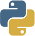

# A Level Python Workshop 
-------------------------------------------------------------------------------------------


## Introduction
Python is a general-purpose, object orientated programming language used by popular websites like YouTube and Dropbox. 

**NOTE:** Before students embark on these lessons they should have an idea about **files** and **directories** including the **working directory** and how to **start a Python interpreter**.  

<h3>Lesson One: The Basics of Python</h3>

**Variables:**

To create such websites, programmers need to be able to store and manipulate data, and they do so using variables. 

*Definition:* **Variables** are the names associated with a pieces of stored data. 

You can assign variables to values like so: 

``` 
01 Test_score = 100
```
***TIP: Never write the value you want to assign to the variable first as that is illogical and Python won't allow it. The variable should always be on the left hand side.*** 

*Definition:* **Identifiers** are names used to refer to variables, functions, etc. 

*Definition:* **Subroutine** are sections of code which perform specific tasks when called from the main body of the code. 

*Definition:* **Parameters & Arguments** are variables which hold values or addresses which are passed into subroutines.

``` 
01 CurrentYear = 2015 
02 BirthYear = 1998 
03 def age (CurrentYear-BirthYear)
```
In the example above you can see that the parameters are "CurrentYear" and "BirthYear" and the arguments are "2015" and "1998".


*Definition:* **Key words** are words reserved by Python that cannot be used as identifiers in your program. Here you can view [official key words list](https://docs.python.org/2.5/ref/keywords.html)  

```E.g. 'print'```


*Definition:* **Arrays** are groups of data of the same data type grouped under the same identifier. Individual items in the array are addressed by their subscripts. 

```
01 #My First Array
02 for column = 1 to 3 
03 	for row = 1 to 5
04 		board[column][row] = 0
05 	next row 
06 next column 
```

**Assignment & Comparative Statements:**

To assign variables to values you use a single equals sign like so: 

``` 
01 MusicRating = 5 
```

However, to compare to check if lines of code are the same you use a double equals sign like so:

```
01 if MusicRatingOfRihanna == MusicRatingOfBeyonce:
02 	print: ("Rihanna is as good an artist as Beyonce.")
03 else:
04 	print: ("Beyonce always wins.")   
``` 


<h3>Lesson Two: Data Types & Structures</h3> 

Programmers often have to deal with lots of data, and this data comes in various different types. 

*Definition:* **Integers** are basically whole numbers. ```E.g. 5 ```

*Definition:* **Real numbers/ floating point** are numbers containing decimals. ```E.g. 1.2 ```

 *Definition:* **Booleans** are used so programmers can represent whether a statement is TRUE or FALSE. ```E.g. 5 > 7
= FALSE```
 
*Definition:* **Strings** are a list of characters which can be alphanumeric. ```E.g. ("Bananas")```
 

**Comments:**

These are lines of text that don't run as part of the program. They are only there to make the code easier to understand They appear at the start of the body of your program with hashes like so : 

```
01 # This Program Navigates Your Character
02 if key_pressed = 1: 
03 	Character moves_forward 
04 elif key_pressed = 2: 
05 	character moves_backward 
06 elif key_pressed = 3: 
07 	character jumps 
```

**Arithmetic Operators:**

You can use different operators to perform different calculations on your code. There are five main types of arithemtic operators which are most commonly used in Python, these are: 

-, +, * (multiplication), / (division), % (modulus), **(exponent)


**Relational Operators:** 

Similarly, relational operators act as conditions to check statements/variables. Below is a table of relational operators:

Symbols | What They do 
:--------:|-------------
= or == | Determines whether two values are equal
<> or != | Determines whether two values are unequal 
< | Determines whether one value is less than another (vice versa for >)
<= | Determines whether one value is less than or equal to another (vice versa for >=)

**Boolean Operators:** 

Conditions in the program help the programmer to make use of the operators AND, NOT and OR to construct expressions. The definitions of these operators are given below: 

X | NOT X 
--|-------
FALSE | TRUE 
TRUE | FALSE 

X | Y | X AND Y 
--|---|--------
FALSE | FALSE | FALSE 
FALSE| TRUE | FALSE 
TRUE | FALSE | FALSE
TRUE | TRUE | TRUE 

X | Y | X OR Y 
--|---|-------
FALSE | FALSE | FALSE
FALSE | TRUE | TRUE 
TRUE | FALSE | TRUE 
TRUE | TRUE | TRUE 

**The Precedence of Standard Operators:**

As in Mathematics, some operators take precedence over others. To figure out which ones are more important simply use the **BODMAS** rule. 

<h3>Lesson Three: String Manipulation</h3>
**Slicing and Concatonation:** 

Python, like other languages has different sets of functions which caan be used to operate on strings. They can be used to conduct various different tasks like to copy, compare or determine the length of a string. Other functions include extracting different parts of strings, working out where a particular phrase appears in a string and converting characters into their ASCII codes and vice versa. 

**Slicing:** 

This is used when you want to extract bits of strings. All you have to do is to specify the starting and end position of the string. 
There are certain rules ou have to follow when attempting to slice strings:

```
  01 MyFavouriteIceCreams = ("Bubblegum, Vanilla and Chocolate.")
  
  02 MyFavouriteIceCreams[:2]	# will find the characters from the start position to position 2. (excluded)
  "Bu"
 
  03 MyFavouriteIceCreams[0:2] # will find the characters from the start position (included) to position 2. (excluded)
  "Bu" 
 
 
  04 MyFavouriteIceCreams[4:]	# will find the characters from position 4 (included) to the end position. 
  "legum, Vanilla and Chocolate"
  
  05 MyFavouriteIceCreams[-2:] # will find the characters from the second-last position (included) to the end position.
  "te"
  
  
  
  06 MyFavouriteIceCreams[2:5] # will find the characters from position 2 (included) to position 5. (excluded)
  "bbl"
 
 ```

**Concatonation:**

This is when two or more strings are combined to form a new string object. 

```
01 first_word = ("Blue")  
02 second_word = ("berry")
03 new_word = first_word + second_word
		   "Blueberry"


```


 
<h3> Lesson Four: The Structure of Procedural Programs</h3> 
**Functions:** 

*Definition:* A function is an easy way of re-executing large pieces of code. You start by defining the function using **def**, followed by a list of **parameter names**. 

```
01 def teacher_average_score = (fairness, skill, strictness, niceness)
02		return (fairness + skill + strictness + kindness/4) 

```
**Debugging Functions** 
Sometimes though, functions don't return the values you want . In order to fix this problem, you've got to **debug** the function. To debug large functions you use debuggers, but if you have a small piece of code, you can:
- Choose any value
- Break the function down into small parts 
- Print out the value of each part to check its correct.


**Local and Global Variables:**

*Definition:* **Local variables** are those declared inside the subroutine and are only available within the subroutine. 

*Definition:* **Global variables** however are those declared at the beginning of the program and are available throughout. 


**Constructs:** 
Programs make use of constructs to make code more efficient and effective. The three basic types of programming constructs used to control execution are **Sequence, Selection & Iteration**.  

*Definition:* **Sequence** is when the instructions are executed in the order in which they appear.

*Definition:* **Iteration** basically means repeating instructions for a set number of times or until a condition is met. 

There are two basic types of Iteration: 

These are **count** and **condition controlled loops**.

There is one type of **count controlled loop** called the **FOR loop**. This loop enables instructions to be repeated for a set number of times. 

```
01 #Check Total Length of Songs
02 TotalLength = 0 
03 For i = 1 to NumberOfSongs 
04  	TotalLength = TotalLength + SongLength(i)
05 Next i 
06 return (TotalLength > 80)
```


There are also two types of **condition controlled loops**, These are the **REPEAT** and **WHILE loops**. 

WHILE loops test the condition at the start of the code and the instrctions following aren't executed unless the condition is met. As a result, it could be that no instrctions are executed.

```
01 #Check Total Length of Songs
02 i =1 
03 while i <= NumberOfSongs
04 	TotalLength = TotalLength + SongLength (i) 
05 i = i + 1 

```
Did you notice the above piece of code is just as same as the previous, but written as a WHILE loop?

REPEAT loops check the condition at the end of the code so the instructions inside the loop will be repeated at least once. 


*Definition:* **Selection** is used when instructions are executed depending upon some condition. Examples of this include **IF** and **SELECT CASE** statements. As a result, some instructions may not be executed. 


<h3> Lesson Five: Errors & Exceptions </h3> 

All prgrammers make errors, some of these are detected by compilers but others may be harder to find and can cause the prgram to produce the incorrect/unexpected results. Errors in Python appear as traceback errors. 
There are three main types of errors, these are syntax, logical and runtime errors. 
 
**NOTE:** You can determine the number of error by looking at the number of levels the traceback has. Look at the example below: 

```
1 import errors_01
2 errors_01.favorite_ice_cream()
```
``` 
---------------------------------------------------------------------------
IndexError                                Traceback (most recent call last)
<ipython-input-1-9d0462a5b07c> in <module>()
      1 import errors_01
----> 2 errors_01.favorite_ice_cream()

/Users/jhamrick/project/swc/novice/python/errors_01.pyc in favorite_ice_cream()
      5         "strawberry"
      6     ]
----> 7     print ice_creams[3]

IndexError: list index out of range


``` 

In this case, there are two errors.

**NOTE:** Most of the time, the bottom most level is where the error actually occured. 

**Syntax Errors:** These occur when the code doesn't follow the rules of the language. For example, if there is a ```colon missing```, if the ```line isn't indented correctly```, if a ```keyword isn't spelt correctly```, if there's a ```misspelt variable```, ```missing quotes on a string or a variable``` that ```should've been defined but wasn't```. 

```
>>> while food_quality = True print ("Good place to eat")
File "<stdin>", line 1, in ?
    while True Print ("Good place to eat")
                   ^
SyntaxError: invalid syntax

```
Try and figure out what the error is in the code above.^

**Logical Errors:** These occur when the program doesn't execute the function that it was intended for. They are caused by ```errors made by the programmer``` when writing the code. 

```
#Total Clothes Cost
jeans_price = 10.99
top_price = 25.00
total_clothes_price = jeans_price and top_price

```
Try and figure out what the error is in the code above.^

**Runtime Errors:** This is picked up when the program is run and usually results in the program crashing. They usualy happen when a ```number overflows```, there's a ```lack of memory``` or there's an ```inexecutable statement``` like division by zero. 

```
How many places would you like your character to move forward?:1000000000000000000000000000

```
Can you guess what the error in the code above is?^

**Item Errors:** These are errors that occur when ```items in containers such as lists and dictionaries are asked for but don't exist```. 

```
favourite_colour  = ["Green", "Blue", "Red", "Purple"]
print ("My favourite colour is "), favourite_colour[4]

```
Guess what the error in the above code is and what will happen when we run the code.^

***REMEMBER: Python doesn't start with 1, but 0.***

**File Errors:** These are known as IO errors. The I and O stand for input and output. These errors occur for a number of reasons. For example, when you try and ```read a file that doesn't exist```, if the ```path for the file you indicated was incorrect``` or if you ```used the "read" flag instead of the "write"``` flag or vice versa. 


If you're ever unsure of the error or how to fix it visit [the official documentation on errors](https://docs.python.org/2/library/exceptions.html) 

***TIP: Look at lines where the errors occured in traceback. File names, levels, error types, etc.***

<h3> Extra: Testing (Test-Driven Developement)</h3>
This is a process whereby the programmer writes tests before writing the function they excercise. 
People believe this to be a great way of writing code because : 

1. If people write tests after writing the thing to be tested they are subject to **conformation bias**. People often subconciously write tests to show that their code is correct, instead of trying to make their code perfect by finding and fixing mistakes. 

2. Writing these tests also helps the programmers figure out exactly what the function is supposed to do. 


